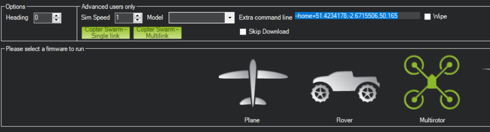
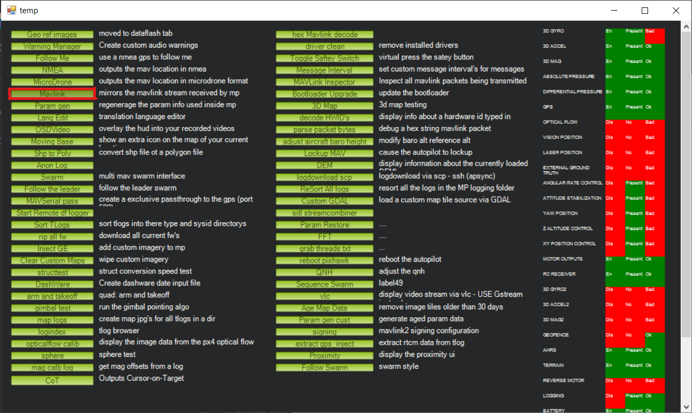
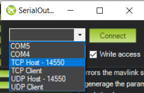
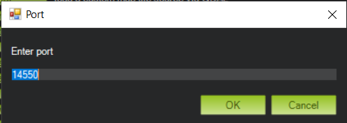
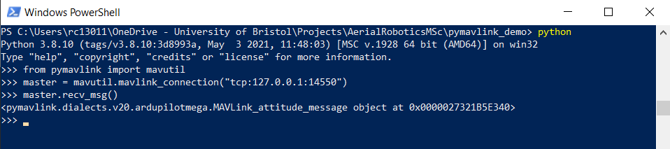
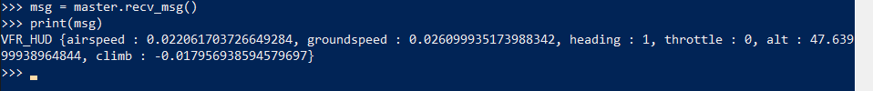
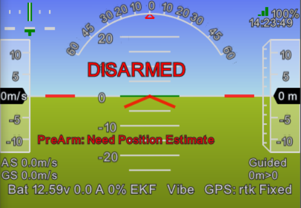
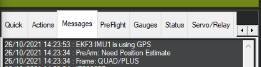

# Installation Steps

### 1. Use the Microsoft store to install Python 3.8:

Use the link: [www.microsoft.com/store/productId/9MSSZTT1N39L](https://www.microsoft.com/store/productId/9MSSZTT1N39L)

### 2. Open PowerShell
Check that your Python installation works:
```ps
python --version
```
You should see `Python 3.8.10`

### 4. Install `pymavlink` and `dronekit`

Using `pip`, install `pymavlink` and `dronekit` by typing the command into PowerShell and pressing enter.

```ps1
pip install pymavlink dronekit
```

`pip` should download the packages and any of their requirements and install them.

If the plain `pip` command doesn't work, try using `python -m pip` instead.

### 5. Check `pymavlink` and `dronekit` installations

First launch Python by running it in PowerShell:

```ps1
python
```

By default, Python will open up in interactive mode, where you can type and have code run instantly. This is
very useful for testing things out.

To test the pymavlink installation, we will enter an import statement at the Python prompt:

```python
>>> import pymavlink
```

If there are no errors shown, the installation is working. Do the same for `dronekit`

```python
>>> import dronekit
```

To exit the Python prompt, either press `Ctrl-Z` and press enter or type `exit()` and press enter.

### 6. Optional: Install VSCode

VSCode is a free editor from Microsoft that is available on multiple platforms. It can be downloaded from
[code.visualstudio.com](https://code.visualstudio.com/) It has support for Python syntax highlighting and
autocomplete by default. Extensions can be added to make it more powerful.

# Setting up the simulator

### 1. Open MissionPlanner and launch the simulation

See notes from Prof. Richardson for setting up MissionPlanner. This time we will be choosing the "Multirotor"
option. As an additional step we will setup the initial location by adding the following to the "Extra command
line" field:

```txt
--home=51.4234178,-2.6715506,50,155
```

This sets up the vehicle at Fenswood Farm, pointing out into the field. Following the `home` option are the
latitude and longitude, in degrees north and east respectively; the altitude in metres above mean sea level; and
finally an initial heading in degrees. As Bristol is west of the Prime Meridian, the longitude value is negative.



### 2. Setup MAVLink output from MissionPlanner

Now we setup MissionPlanner to mirror it's received MAVLink stream so our script can connect.

From the main MissionPlanner screen, press `Ctrl+F`

A window appears with additional options:



Click "Mavlink" from first column (highlighted in red above). This opens a small window:



In this window, choose 'TCP Host - 14550' from the first box. This will setup MissionPlanner to
act as a TCP server. Our script will then act as a TCP client and connect to this server to receive
the MAVLink stream.

"Write access" needs to be checked. This tells Mission Planner to allow data to be written from the
connected script back up to the simulated vehicle.

Nothing is needed for the other box in this window.

Click "Connect" and a final window will appear:



Here you can set the port for the TCP server to listen on. For now, we'll leave it at `14550` and click "OK"

### 3. Test our connection is working

Back in PowerShell, type `python` to launch the standard Python prompt. Here you can type in lines of Python code to
be executed immediately. We will type a few lines to test our connection:

```python
>>> from pymavlink import mavutil
>>> master = mavutil.mavlink_connection("tcp:127.0.0.1:14550")
>>> master.recv_msg()
```

You should see that a message object has been received. The exact type will differ depending on the most recently received message.



You can also print the message to see its contents:



# Troubleshooting

### Vehicle does not arm

If you run your script too quickly after starting the simulator, the vehicle may fail to arm. This may be because the vehicle is
still in the process of initialising.

`PreArm: Need Position Estimate` is a typical warning. It means that the Extended Kalman Filter (EKF) has not been running for
long enough to have fused all the data it needs for a stable position estimate.



You can view messages from the vehicle using the "Messages" tab in MissionPlanner. Waiting until you see the `EKF3 IMU1 is using
GPS` message ensures that the EKF has generated a stable position estimate. You could add to the script to check if the arming was
successful and try again following a failure.


